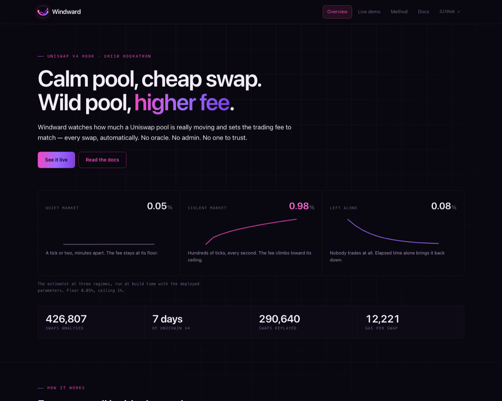
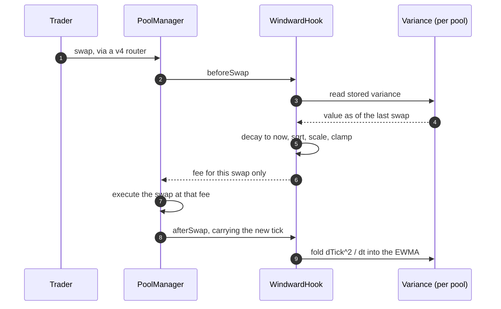
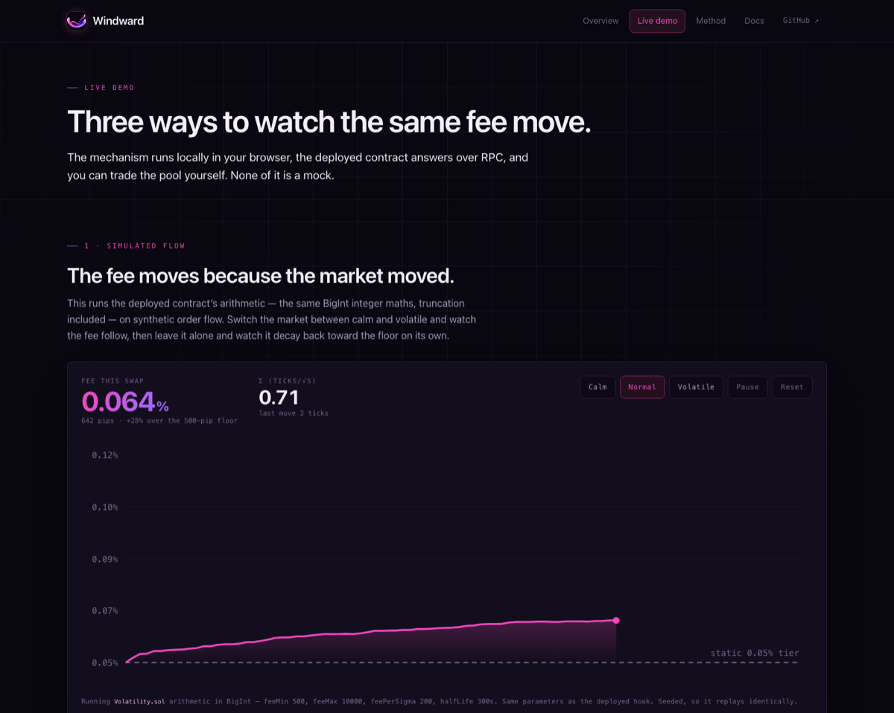
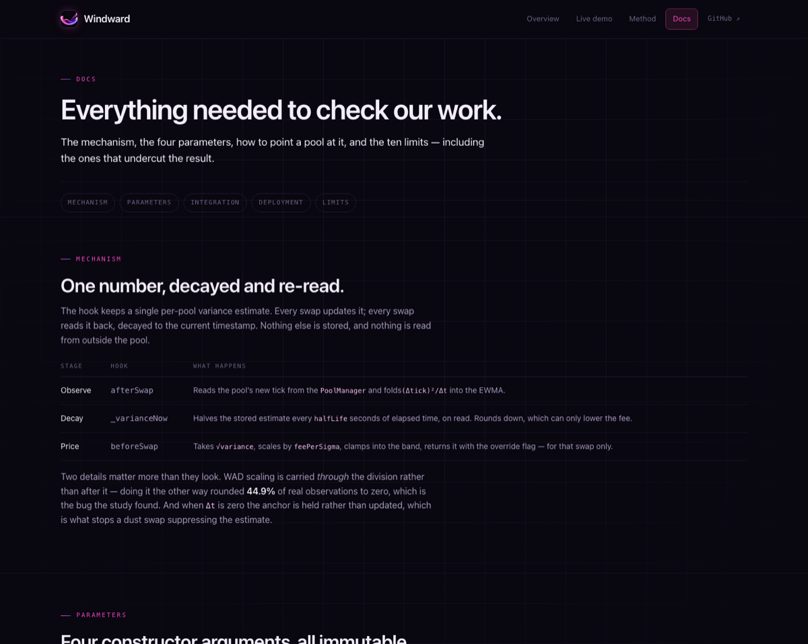

# Windward

**A Uniswap v4 hook that charges more to trade a pool while it is moving violently, and less
while it is calm — reading nothing but the pool's own price history.**

UHI10 Hookathon · *The Fair Flow Frontier* · MIT licensed

Live on Unichain Sepolia: **`0x609634584d5BD12Ba4216116528e364d385Ad0C0`** — runtime bytecode
verified against source (`docs/DEPLOYMENT.md`).



## What it does

A static fee charges the same whether a pool is asleep or being torn apart. Windward charges for
what is actually happening:

- **Calm pool → 0.05%.** Ordinary flow in a quiet market pays the floor.
- **Violent pool → up to 1%.** Whatever trades next after a large move pays for the disruption.
- **Back down on its own.** The estimate decays with elapsed time, so a pool returns to its floor
  with nobody trading it. No keeper, no admin, no oracle.

It prices **movement, not motive**. It cannot tell a legitimate large trade from a hostile one and
does not try to — see [Limitations](#limitations).

## Architecture

Everything happens inside the swap. There is no external call, no price feed and no off-chain
component: the hook reads the tick that the `PoolManager` itself just wrote.



| Property | How it is enforced |
|---|---|
| Cannot move funds | All four `*_RETURNS_DELTA` address bits are clear, so v4 never parses a delta from it |
| Cannot be paused, upgraded or retuned | No owner, no setter; all four parameters are `immutable` |
| Cannot be fed a forged price | The tick comes from the `PoolManager`, not from the caller |
| Costs | 12,221 gas per swap — 17% of an unhooked swap |

## Quick start

```bash
forge test                             # 61 tests
python3 analysis/test_differential.py  # model <-> contract agreement
script/demo.sh                         # 6.8s cold, fully offline
analysis/run.sh                        # 102s warm; a cold run refetches 541MB
```

Run the site:

```bash
cd web && npm install && npm run dev    # http://localhost:3000
```

Point it at a real pool on a local fork:

```bash
anvil --fork-url https://sepolia.unichain.org --auto-impersonate
forge script script/SeedPool.s.sol:SeedPool --rpc-url http://localhost:8545 \
  --sender 0x30c7eE328B80ce1dc15AC8F75e1FfAf51B9bB9Fb --unlocked --broadcast
# copy the printed pool id and token addresses into web/.env.local
```

Swaps only move the estimate when they land in **different blocks** — `dt == 0` is an identity,
which is what closes the dust-swap attack. Run `script/Trade.s.sol` repeatedly, not once.

## The site

Three pages, all reading the same committed JSON the study produced.

| | |
|---|---|
|  | **`/demo`** — the estimator running in the browser on synthetic flow, the deployed contract read live over RPC, and a pool you can trade yourself with a wallet. |
|  | **`/docs`** — the mechanism, the four parameters, integration requirements, deployment evidence, and all ten limits. |

## The finding

Two of the three signals most often proposed for MEV-aware fees are **inverted** on Unichain. We
measured all three on 426,807 real swaps over 7 days.

**Priority fee — inverted.** Taxing a searcher's tip assumes a contested priority auction. On
Unichain **82.7%** of swaps are already first for their pool in their block. Retail through the
Universal Router pays a median tip of **1,450,000 wei** — a flat wallet default. The arbitrage
proxy pays **83,161 wei**, and **83.8%** of it pays below the median retail swap (**17.4×**,
n=619). A priority-keyed fee here taxes retail and subsidises arbitrage.

**Price staleness — also inverted.** The LVR argument says an idle pool accumulates divergence, so
the next trade is more toxic. Bucketing consecutive swap pairs by the gap between them, the
longest-gap decile precedes **smaller** moves: lift **0.69–0.94×** against a shuffled null of
**0.92–1.06×**, in all five busiest pools. (`analysis/staleness.py`. Magnitude not claimed — v4
logs post-swap ticks, so each interval includes its closing swap's impact. The sign is what this
measures.)

**Realised variance — survived.** The pool's own tick history, put through the same test.

### Does the fee actually track volatility?

This needs a null — otherwise "our fee varies a lot" proves nothing, since a random number
generator varies too. For each pool, shuffle the order of the real `(tick move, block gap)`
observations with a fixed seed. That preserves the multiset **exactly** — same heavy tail, same
median, same maximum — and destroys only volatility clustering, the one thing an adaptive fee
could exploit.

**Bucket every swap by the fee charged, then measure the tick move that actually followed:**

| pool | swaps | decile 1 | decile 10 | lift | null lift | ρ | null ρ |
|---|---|---|---|---|---|---|---|
| `0xc4f393…` | 89,048 | 1.53 | 7.31 | **4.78x** | 1.04x | 0.2501 | 0.0129 |
| `0x75b192…` | 76,313 | 1.25 | 8.15 | **6.52x** | 1.13x | 0.1965 | 0.0135 |
| `0x3258f4…` | 71,915 | 0.79 | 1.51 | **1.91x** | 1.01x | 0.1005 | 0.0148 |
| `0x04b7dd…` | 31,011 | 2.08 | 2.80 | **1.35x** | 0.99x | 0.2353 | 0.0662 |
| `0x51f9d6…` | 22,353 | 0.57 | 1.07 | **1.88x** | 1.13x | 0.1217 | 0.0330 |

Deciles are mean realised tick move over the interval each swap opened. Across 290,640 replayed
swaps the top fee decile precedes tick moves **1.35–6.52x** larger than the bottom, in all five
pools, against a null of **0.99–1.13x**. ρ is Spearman rank correlation against realised forward
variance. Read effect sizes, not significance: at this sample size an economically worthless
correlation would still clear any threshold.

**We ran this null on our own headline metrics first, and they failed it.** "Sits at the fee floor
0.0% of the time" and "takes 440–2,412 distinct values" are both reproduced by the shuffle — the
null even wins a pool. Both were demoted to a diagnosis of the integer-truncation bug that real
data caught and unit tests did not (`docs/ABLATION.md`).

**What this does not show.** Charging at the right *times* is necessary, not sufficient. It does
not show the revenue exceeds the adverse selection it offsets. **The LP benefit is unvalidated.**
Reproduce: `python3 analysis/economics.py`.

## Testing

61 tests, green under both profiles (`forge test`, `FOUNDRY_PROFILE=deep forge test`). Fuzzing
uses a fixed seed so evidence is reproducible: 1,000 runs by default, 100,000 under `deep`.

Two standing rules: **never weaken a test to make a suite pass**, and **every finding gets a named
regression test before it is fixed**, written while it still fails so it has proven it can fail.

## Security

Six independent reviews across two rounds. **Eight findings fixed, each pinned by a regression
test that fails if the fix is removed; one open and documented rather than quietly dropped.**

The second round found two issues the first missed, both confirmed by our own probe tests rather
than taken on trust. **H-1** (fixed): the fee was priced from *undecayed* state, so a pool at the
1% ceiling still quoted 1% after seven silent days. **C-1** (open, accepted): a same-block round
trip can strand the tick anchor, so the next honest swap pays for a phantom move — it cannot move
funds, but a production deployment must fix it.

Full policy in **`SECURITY.md`**; every vector in **`THREAT_MODEL.md`**.

**Not audited. Prototype. Must not secure real funds.**

## Limitations

The six that most affect how the result should be read. All ten are in `docs/LIMITATIONS.md`.

1. **Windward is a HEURISTIC, and the word *optimal* does not describe it.** Motivated by the
   loss-versus-rebalancing literature — **not** an implementation of any optimal policy from it,
   and **not** validated as improving LP outcomes (`DECISIONS.md` D-0019).
2. **The LP benefit is unvalidated.** We measure *fee revenue*, not LP PnL, with no
   demand-elasticity model. `test_sanity_…` proves `10000 > 500` and is **not evidence**.
3. **The replay covers the 5 busiest pools only.** **136,167 swaps across 227 pools (31.9% of the
   window) were never replayed** — the thin, low-activity pools where the estimator is least
   tested. **The thin-pool regime is untested.**
4. **The tick is steerable.** A funded actor can raise a pool's fee by trading it.
5. **All four hook parameters are underived deployment choices, not results.** `feeMin` (500),
   `feeMax` (10000), `feePerSigma` (200) and `halfLife` (300s) are constructor arguments picked by
   hand. **Nothing in the study derives, fits, or optimises any of them**, and no sensitivity
   analysis was run.
6. **The lift result is a correlation, not a causal or welfare claim.** It shows the fee is charged
   at the right *times*, not that the revenue exceeds the adverse selection it offsets. See #2.

## Partner integrations

**Unichain** — the only one, and it is load-bearing rather than decorative:

- The hook is deployed and bytecode-verified on **Unichain Sepolia** (chain 1301) —
  `docs/DEPLOYMENT.md`, address and receipt read back from chain.
- The entire empirical study is Unichain mainnet data: 426,807 swaps over 7 days, ingested by
  `analysis/fetch.py`, pinned to a fixed end block in `analysis/PINNED_END_BLOCK`.
- Both inversion findings are **specific to Unichain's microstructure** and would not hold on a
  congested L1 — `analysis/stats.py` (priority fee) and `analysis/staleness.py` (staleness).
- `script/SeedPool.s.sol` and `script/Trade.s.sol` create and trade a live pool against the
  deployed hook using Unichain Sepolia's own `PoolSwapTest` router.

No other partner technology is used.

## Repository map

| Path | What |
|---|---|
| `src/` | The hook and its estimator |
| `analysis/` | The study; `run.sh` reproduces every number here |
| `analysis/staleness.py` | The staleness inversion, with its null |
| `web/` | Next.js site: the result, a fee simulator, and a live on-chain read |
| `data/*.json` | **Every published figure is read from these files** |
| `docs/ABLATION.md` | The truncation bug, and which repair did what |
| `docs/GAS.md` | Gas overhead in dollars, and the breakeven swap |
| `docs/SIGNALS.md` | Signals measured and rejected; why we read the tick |
| `docs/CORRECTIONS.md` | Claims this project retracted |
| `docs/LIMITATIONS.md` | All ten limitations |
| `docs/DEPLOYMENT.md` | Deployment evidence, read back from chain |
| `THREAT_MODEL.md` · `SECURITY.md` · `DECISIONS.md` | Vectors · policy · append-only decision log |

MIT licensed. See `LICENSE`.
